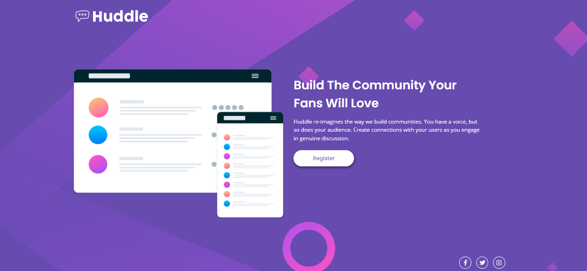
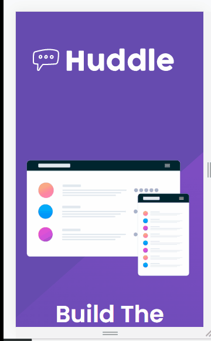

# Hudde landing page design 

## This is my resolution to challenge proposed by my teachers taken fron the: (https://www.frontendmentor.io/challenges/huddle-landing-page-with-a-single-introductory-section-B_2Wvxgi0)

 

## index
- [About the challenge](#About-the-challenge)
- [Overview](#Overview)
- [Tecnologies used](#Tecnologies-used)
- [Acquired knowledge](#Acquired-knowledge)
- [Challenges encountered](#Challenges-encountered)
- [Contact](#contact)

## About the challenge
 Users will be able to see:

 - View the optimal layout regardless of screen size 
## Overview
Desktop screen view:

Mobile screen overview:

[]

## Technologies used

- HTML 
- CSS

## Acquired knowledge
- This project helped me to understand better about responsiveness
- How to use semantic tags in html
- Use relative measures instead of fixed measures

## Challenges encountered
- My biggest difficulty was making the page responsive

## Contact
- LinkedIn - [Rafael Rodrigues](https://github.com/rafael-rodrigues01)

## Thanks

I would like to thank God, my teachers Roberto and Ricardo Dias, Pablo and Rafael, and the entire DevQuest team for giving me the support to carry out this challenge.

